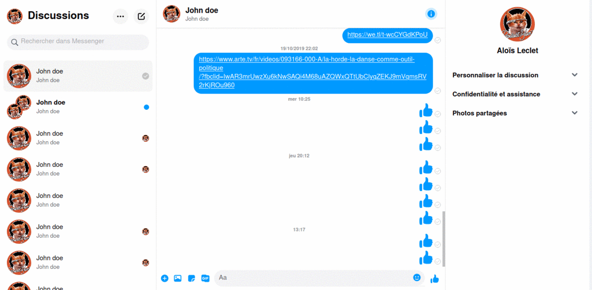

# Messenger for poweruser

*Experience Messenger with dark mode & vim oriented keyboard shortcuts*
*Forget your mouse*

 

## Install Extension

|Platform|Link|
|:-:|:-:|
|| [Firefox Extension](https://addons.mozilla.org/addon/messenger-for-poweruser/)|
## How to use

1. login on your messenger account on your browser

2. test keyboard (vim like) shortcuts

* <kbd>i</kbd>           ->  focus chat input 
* <kbd>/</kbd>           ->  focus search input
* <kbd>Escape</kbd>      ->  blur all
* <kbd>j</kbd>           ->  scroll bottom (when no input are focused)
* <kbd>k</kbd>           ->  scroll top (when no input are focused)
* <kbd>Tab</kbd>         ->  switch between chat area and contact area (when no input are focused)
* <kbd>h</kbd> or <kbd>l</kbd>      ->  switch between chat area and contact area (when no input are focused)
* <kbd>o</kbd>           ->  open information sidebar (when no input are focused)
* <kbd>u</kbd>           ->  send a like or primary emoji (when no input are focused)
* <kbd>d</kbd>           ->  switch dark mode on/off (when no input are focused)
* <kbd>a</kbd>           ->  open active contacts (when no input are focused)

## ScreenShots

## How to use

1. login on your messenger account on your browser

2. test keyboard (vim like) shortcuts

* <kbd>i</kbd>           ->  focus chat input 
* <kbd>/</kbd>           ->  focus search input
* <kbd>Escape</kbd>      ->  blur all
* <kbd>j</kbd>           ->  scroll bottom (when no input are focused)
* <kbd>k</kbd>           ->  scroll top (when no input are focused)
* <kbd>Tab</kbd>         ->  switch between chat area and contact area (when no input are focused)
* <kbd>h</kbd> or <kbd>l</kbd>      ->  switch between chat area and contact area (when no input are focused)
* <kbd>o</kbd>           ->  open information sidebar (when no input are focused)
* <kbd>u</kbd>           ->  send a like or primary emoji (when no input are focused)
* <kbd>d</kbd>           ->  switch dark mode on/off (when no input are focused)
* <kbd>a</kbd>           ->  open active contacts (when no input are focused)

## About Messenger for poweruser

Use messenger without mouse is now possible. And that's great !

Feel free to open issues or pull requests!

## Privacy

This extension **DO NOT** read or save any of your informations. 

#### dev with <3 by @aloisleclet
